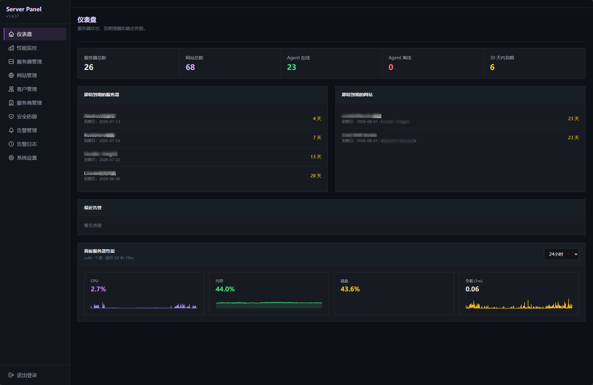
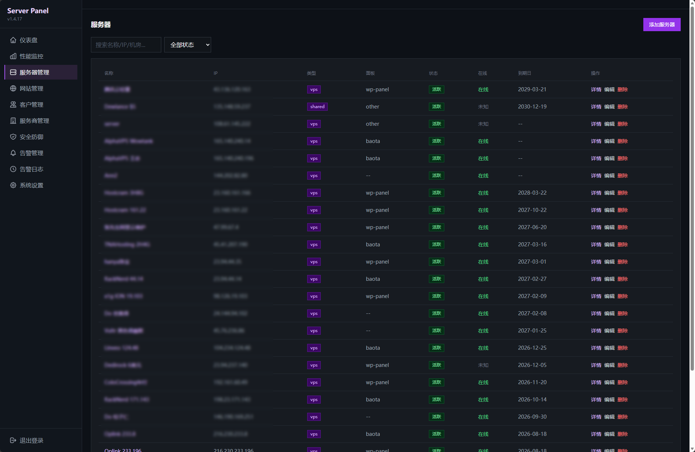
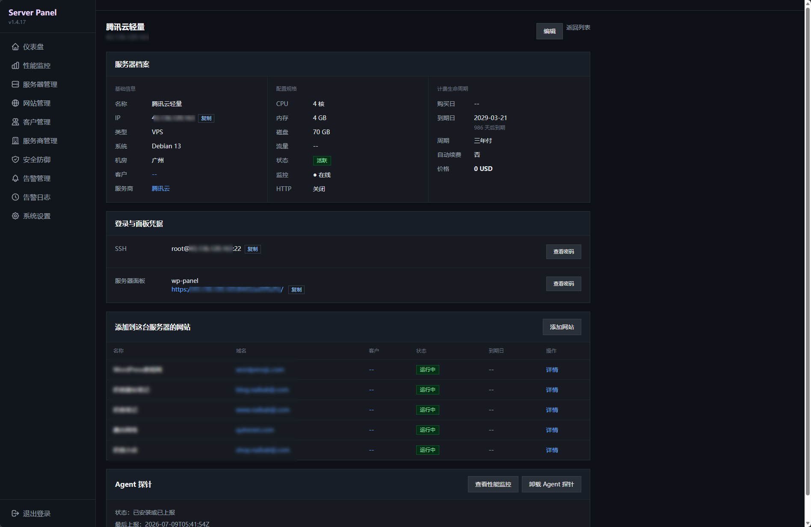
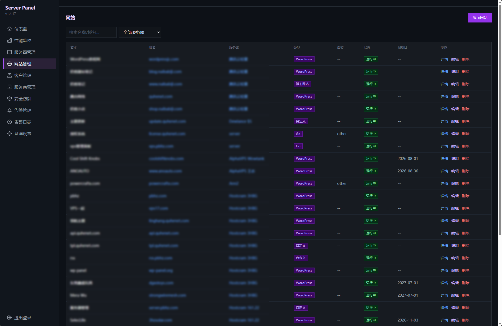
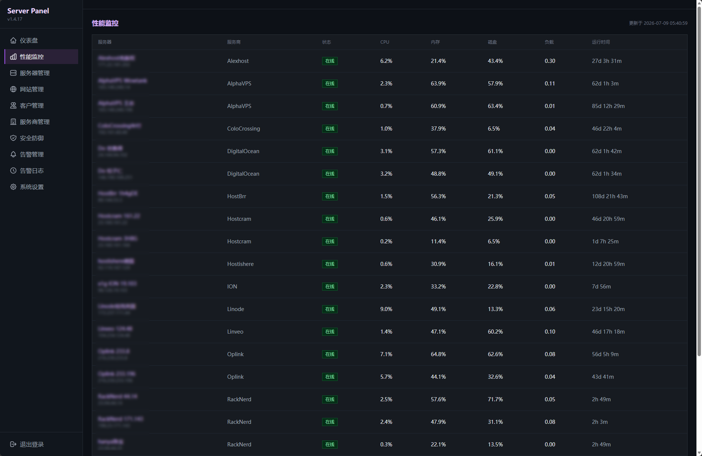
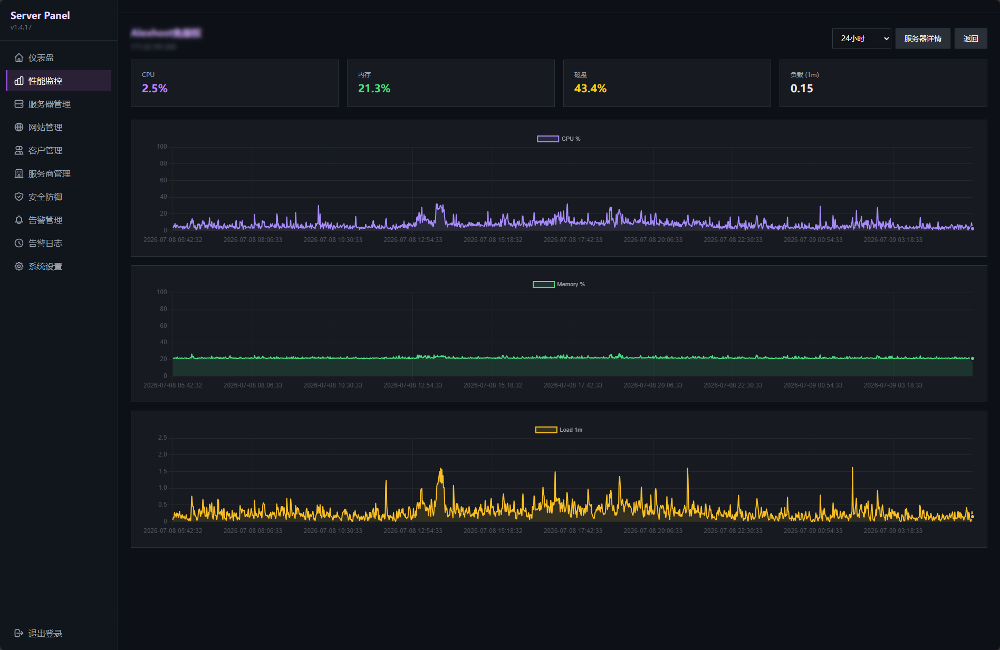
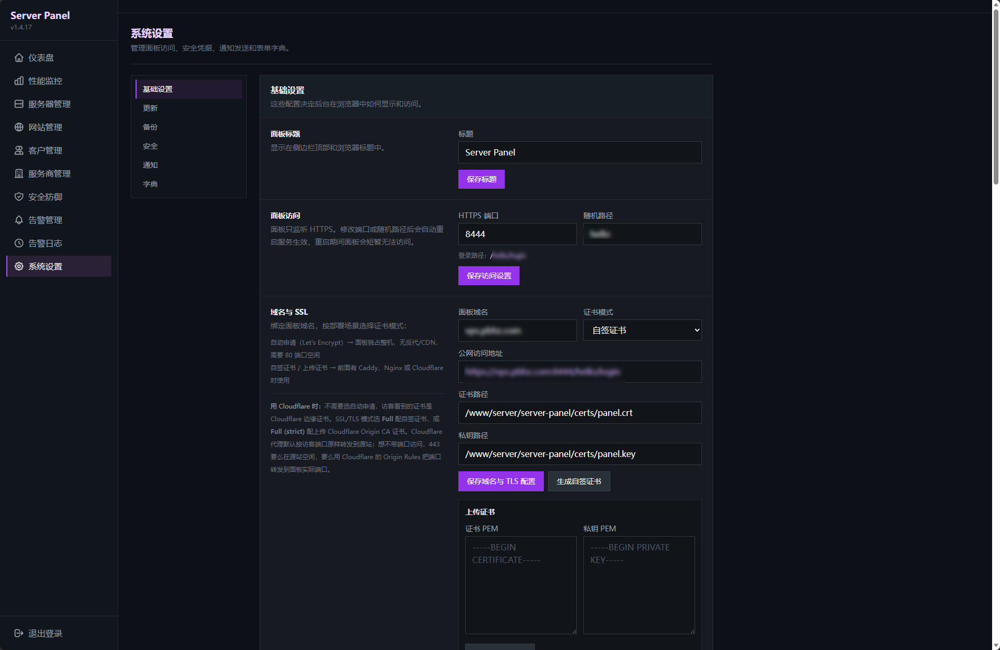

# Server Panel

安全优先的自托管服务器管理面板，用于集中管理 VPS、独立服务器、网站、客户、服务商、到期提醒、Agent 性能监控和告警通知。

Server Panel 是一个面向个人站长、独立开发者、小团队和运维人员的轻量级服务器资产管理系统。它使用 Go 单二进制部署，内置 HTTPS、登录保护、SQLite 数据库、Agent 探针、网站管理、客户管理、服务商管理、备份恢复和在线更新，适合放在自己的 VPS 或独立服务器上作为私有运维面板。

如果你需要一个自托管的服务器管理面板、VPS 管理面板、网站运维面板、服务器资产管理系统、服务器到期提醒工具或轻量级监控面板，Server Panel 的目标是把这些常用能力放进一个简单、安全、可独立掌控的面板里。

## 快速概览

**主要功能**

- 服务器、网站、客户、服务商资产集中管理
- Agent 性能监控（CPU/内存/磁盘/网络/负载/心跳）
- 到期提醒与告警（HTTP 探测、离线、资源、到期），支持 SMTP 邮件
- 面板在线更新与系统包更新
- 备份与恢复（含数据库和加密密钥）
- 多层安全防护（随机入口、双层登录、查看密码、自动封禁、nftables 联动）

**一键安装**（Debian/Ubuntu 等 systemd 服务器，root 执行）：

```bash
curl -fsSL https://raw.githubusercontent.com/naibabiji/server-panel/master/install.sh | bash
```

安装后访问 `https://your-server:8444/<随机路径>/login`，账号密码在安装日志中查看。

## 界面预览

<table>
  <tr>
    <td width="50%" align="center"><a href="screenshots/dashboard.png"></a><br><sub>仪表盘：服务器/网站总数、Agent 状态、30 天内到期数量、近期告警</sub></td>
    <td width="50%" align="center"><a href="screenshots/servers.png"></a><br><sub>服务器管理：集中管理 VPS、独立服务器、共享主机等资产</sub></td>
  </tr>
  <tr>
    <td width="50%" align="center"><a href="screenshots/servers-2.png"></a><br><sub>服务器详情：配置、到期、价格、Agent 状态、加密凭据</sub></td>
    <td width="50%" align="center"><a href="screenshots/websites.png"></a><br><sub>网站管理：域名、所属服务器/客户、面板信息、到期状态</sub></td>
  </tr>
  <tr>
    <td width="50%" align="center"><a href="screenshots/monitor.png"></a><br><sub>性能监控总览：按服务商分组查看所有服务器实时状态</sub></td>
    <td width="50%" align="center"><a href="screenshots/monitor-2.png"></a><br><sub>单机监控详情：CPU、内存、磁盘、网络、负载历史曲线</sub></td>
  </tr>
  <tr>
    <td width="50%" align="center"><a href="screenshots/settings.png"></a><br><sub>系统设置：账号、安全、备份、SMTP、自动更新等配置</sub></td>
    <td width="50%"></td>
  </tr>
</table>

## 适合谁使用

Server Panel 适合：

- 管理多台 VPS 或独立服务器的个人站长
- 需要记录客户网站、服务器、服务商和到期时间的小团队
- 希望自托管服务器资产管理系统的运维人员
- 不想把服务器密码、客户信息和运维资料放到第三方 SaaS 的用户
- 需要轻量级 Agent 监控和到期提醒的开发者

Server Panel 不适合：

- 大型多租户云管平台
- 需要复杂 RBAC、审批流和工单系统的企业 ITSM 场景
- 不愿意自行维护面板安全边界的公开公网后台

## 安装

### 安装要求

- Linux + systemd
- amd64 或 arm64 架构
- root 权限安装
- 服务器能访问 GitHub Releases；不能直连时可使用手动安装，或在 Agent 安装时填写 GitHub 反代地址

> Server Panel 在 Debian 13 上进行开发和测试，Debian 13 为主要目标环境。其他 Linux 发行版（包括其他 Debian/Ubuntu 版本）可尝试使用，但不保证稳定性和可用性。

### 一键安装

```bash
curl -fsSL https://raw.githubusercontent.com/naibabiji/server-panel/master/install.sh | bash
```

安装脚本会自动完成：

- 下载匹配当前架构的最新 Release 二进制
- 创建安装目录
- 生成自签 TLS 证书
- 生成随机访问路径
- 生成面板账号密码
- 生成 BasicAuth 账号密码
- 创建 systemd 服务
- 启动 `server-panel`

已有安装时，默认会保留配置、数据库、证书和登录信息，只覆盖升级二进制。

如果需要重新生成配置和登录信息：

```bash
curl -fsSL https://raw.githubusercontent.com/naibabiji/server-panel/master/install.sh | INSTALL_MODE=reinstall bash
```

### 手动或离线安装

把 `install.sh` 和 Release 附件里的二进制放在同一目录：

- `server-panel-linux-amd64`
- 或 `server-panel-linux-arm64`

然后执行：

```bash
bash install.sh
```

### 常用命令

```bash
systemctl status server-panel
systemctl restart server-panel
journalctl -u server-panel -f
server-panel --reset-password
```

从备份恢复：

```bash
systemctl stop server-panel
server-panel -config /www/server/server-panel/config.json -restore-backup=/path/to/server-panel-backup.<timestamp>.tar.gz
systemctl start server-panel
```

## 核心功能

### 服务器资产管理

- 管理 VPS、独立服务器、共享主机和其他服务器资产。
- 记录 IP、系统、CPU、内存、磁盘、带宽、机房、购买日期、到期日期、续费周期、价格、币种和状态。
- 关联客户和服务商，适合管理多台服务器、多客户网站或多个云厂商账号。
- 支持普通备注换行展示。

### 网站管理

- 管理网站名称、域名、网站类型、所属服务器、所属客户、面板类型、面板地址、面板账号、到期日期和状态。
- 支持网站面板密码加密保存，并通过查看密码单独授权查看。
- 网站列表支持搜索、筛选和分页。

### 客户与服务商管理

- 维护客户资料、联系方式、公司信息、地址和备注。
- 维护服务商官网、联系方式、普通备注和加密备注。
- 服务商加密备注需要查看密码验证后才能查看，也支持清空。
- 支持从客户或服务商详情页查看关联服务器和网站资源。

### Agent 性能监控

- 为被管理服务器安装独立 Agent，采集 CPU、内存、磁盘、网络、负载、运行时间和心跳状态。
- 面板提供性能监控总览和单机监控详情。
- 相同服务商的服务器会排列到一起，便于观察同一厂商资源状态。
- 国内服务器无法访问 GitHub 时，可在单台服务器生成安装脚本时临时填写 GitHub 反代地址，不会保存为全局设置，也不会影响其他服务器。

### 到期提醒与告警

- 仪表盘展示服务器总数、网站总数、Agent 在线、Agent 离线、30 天内到期数量。
- 分别展示即将到期的服务器和网站。
- 支持 HTTP 探测异常、服务器离线、CPU、内存、磁盘和到期告警。
- 支持告警日志和 SMTP 邮件通知。

### 面板更新与系统维护

- 面板支持在线检查更新、一键更新和自动更新策略。
- 更新过程包含下载、校验、备份、替换、重启和健康检查。
- 支持更新失败后的自动回滚能力。
- 支持检查 Debian/Ubuntu apt 可升级包，并可在面板内执行系统包更新。

### 备份与恢复

- 可在设置页生成完整备份包。
- 备份包含 SQLite 数据库和加密密钥。
- 支持上传备份并安排恢复。
- 也支持通过命令行恢复，适合服务器重装或迁移后使用。

## 安全设计

服务器管理面板里通常保存服务器 IP、登录用户名、面板地址、客户资料、服务商信息、到期时间、续费价格，以及可能保存的 SSH 密码或网站面板密码。这些资料关系到你的服务器、网站、客户和运维入口，所以 Server Panel 的安全设计目标很明确：

- 让别人尽量难以找到面板入口。
- 即使打开了面板地址，也不能直接进入后台。
- 即使登录了后台，也不能直接看到已保存的密码。
- 如果查看密码被连续猜错，优先清空敏感凭据，保住服务器和网站资料本身。
- 更新、备份、Agent 上报这些高风险操作，也要有基础保护。

Server Panel 不是把所有资料都简单放在一个登录页面后面，而是把"普通资料"和"敏感凭据"分开保护。

### 普通资料与敏感凭据

服务器名称、IP、到期时间、价格、客户、服务商、网站域名等属于**普通资料**，用于日常查看和管理。

下面这些属于**敏感凭据**，会单独加密保存：

- 服务器 SSH 密码
- 服务器面板密码
- 网站面板密码
- 服务商加密备注
- Agent 安装密钥

登录面板后可以看到服务器和网站资料，但不能直接看到这些密码；只有再次输入查看密码后，才能临时查看。

### 极端情况下会损失什么

很多用户最关心的是：如果有人尝试破解查看密码，或者自己忘记查看密码，会不会影响已经记录的服务器和网站？

**不会删除的内容：** 服务器记录、网站记录、客户资料、服务商资料、到期时间、价格、备注、监控数据和告警记录。

**会被清空的内容：** 已保存的敏感凭据，例如服务器 SSH 密码、服务器面板密码、网站面板密码。清空后需要重新填写。

这样做的目的是：当有人连续猜错查看密码时，宁可丢失已保存的密码副本，也不要让攻击者继续尝试直到看到真实密码。你的服务器和网站本身不会因为这个动作被删除或停止运行。

### 多层防护一览

假设有攻击者想通过面板看到你保存的密码，他需要连续突破多道防线：

| 防线 | 攻击目标 | 防护措施 | 结果 |
|---|---|---|---|
| 1. 找到入口 | 猜到面板登录地址 | 安装后使用随机访问路径，不是 `/admin`、`/login` | 即使知道服务器 IP 也要先猜到地址，多数扫描器停在此层 |
| 2. 通过入口密码 | 看到登录表单 | BasicAuth 入口密码额外一层验证 | 猜到地址也没入口密码，看不到登录页 |
| 3. 登录后台 | 通过面板账号密码登录 | 独立账号密码，失败次数过多自动封禁来源 IP | 持续尝试会被加入封禁列表 |
| 4. 查看敏感信息 | 查看 SSH/面板密码或加密备注 | 敏感内容加密保存，查看需再次输入查看密码 | 进入后台也看不到真实密码 |
| 5. 猜查看密码 | 暴力尝试查看密码 | 连续输错 5 次触发保护动作 | 系统自动清空已保存的敏感凭据，而非暴露密码 |
| 6. 利用 Agent 入口 | 伪装 Agent 上报或读取密码 | 每台服务器独立安装密钥，重生成后旧密钥失效；Agent 只上报监控数据，不读取面板密码 | 单台 Agent 配置泄露不等于全部失守 |
| 7. 替换更新包 | 让面板下载到被替换的程序 | 在线更新校验下载文件和签名，非"下载成功即替换" | 文件损坏或校验不通过时更新中止，失败会回滚 |

此外，针对脚本或扫描器批量访问 `/admin`、`/wp-login.php`、`/.env` 等不存在路径的行为，Server Panel 会识别为扫描探测：记录来源 IP 并封禁；若系统支持 nftables，会把它加入系统防火墙封禁集合，在面板端口上直接阻断访问。

最终攻击者通常面临三种结果：找不到随机入口；进了登录页但没有账号密码；登录了后台但没有查看密码，仍看不到敏感凭据，暴力尝试反而会触发清空。

### 忘记查看密码怎么办

查看密码不支持找回，系统不能帮你把原密码解出来。

如果需要重新设置查看密码，需要接受一个结果：已保存的服务器/网站密码副本会被清空。清空后，服务器、网站、客户、服务商等记录仍然保留，只是原来保存的 SSH 密码、面板密码需要重新填写。

### 默认开启的安全设置

- 安装时生成随机访问路径、独立面板登录密码和额外入口密码。
- 使用 HTTPS 访问，自动生成自签证书，也支持后续配置自己的证书。
- SSH 密码、服务器面板密码、网站面板密码不明文展示，查看需再次输入查看密码。
- 查看密码不支持找回，连续输错 5 次自动清空已保存的服务器/网站敏感凭据。
- 登录、表单提交和后台接口都有基础防护，减少误操作、跨站提交和暴力尝试风险。
- 登录失败、入口密码失败和扫描未知路径会触发自动封禁。
- 支持和系统 nftables 防火墙联动；被封禁 IP 在面板端口上被直接阻断。
- 面板内置安全防御页面，可查看封禁记录、手动解封和维护 IP 白名单。
- Agent 探针每台服务器使用独立安装密钥，重新生成安装命令会让旧密钥失效。
- 在线更新会校验下载文件，避免更新包损坏或被替换。
- 备份会同时保存数据库和加密密钥，方便迁移或重装后恢复。
- 接入 Cloudflare 或反向代理时，可配置真实访客 IP，避免安全判断误认来源。

> 任何服务器面板都不建议完全裸露在公网里。更稳妥的做法是使用强密码、开启 HTTPS，并按需放在 Cloudflare、VPN、Tailscale、WireGuard、Nginx/Caddy 反代或防火墙之后。

## 部署注意事项

### Cloudflare 和反向代理

如果面板部署在 Nginx、Caddy 或 Cloudflare 后面，需要让面板识别真实访客 IP，否则登录保护、封禁记录和安全日志会误把反向代理的 IP 当成访客来源。

这两项可以直接在后台配置：进入 **设置 → 面板访问**，按实际部署方式一键开启或关闭，保存后面板会自动重启生效，不需要手动编辑 `config.json`。

**可信反向代理 IP**

- 面板放在 Nginx、Caddy 或其他反向代理后面时，在后台开启“反向代理真实 IP 识别”。
- 同机反向代理（Nginx/Caddy 和面板跑在同一台服务器）开启后默认使用 `127.0.0.1` 和 `::1`。
- 如果反向代理跑在**另一台机器**上，需要把那台机器的 IP 加入列表，面板才会从 `X-Forwarded-For` 读取真实访客 IP。
- 后台输入框支持每行一个 IP 或 CIDR，例如 `10.0.0.10`、`192.168.0.0/24`。
- 关闭“反向代理真实 IP 识别”表示不信任任何反向代理。

**Cloudflare 模式**

- 面板接入 Cloudflare 代理时，在后台一键开启。面板会自动拉取并每日刷新 Cloudflare 的 IP 段，对来自 Cloudflare 边缘的请求从 `CF-Connecting-IP` 还原真实访客 IP。
- 没有接入 Cloudflare 时保持关闭，避免错误信任外部请求头。

### 自动封禁和内置防火墙

Server Panel 有内置安全防御页面，可以查看当前封禁记录、手动解封 IP，也可以把可信 IP 加入白名单。

自动封禁主要会在这些情况下触发：

- 入口密码连续失败。
- 面板登录连续失败。
- 非浏览器脚本扫描未知路径。

当系统安装了 `nftables` 并且面板有权限调用 `nft` 时，Server Panel 会创建自己的防火墙表和封禁集合，把被封禁 IP 加进去。这样这些 IP 不只是被后台拒绝，而是在面板监听端口上被系统防火墙直接拦下。

如果系统没有 `nftables`，面板仍会记录封禁信息，并在面板层面拒绝已封禁来源。建议生产环境保留系统自带防火墙能力，让自动封禁效果更完整。

### 备份不只是数据库

面板里的密码是加密保存的，所以只备份数据库还不够。Server Panel 的完整备份会包含数据库和加密密钥。

如果你以后迁移服务器或重装系统，使用完整备份恢复后，原来保存的敏感凭据才能继续解密。

## 搜索关键词

服务器管理面板、VPS 管理面板、服务器资产管理、网站管理面板、运维管理面板、服务器监控面板、Agent 监控、服务器到期提醒、网站到期提醒、客户服务器管理、服务商管理、Go 管理面板、自托管服务器面板、SQLite 运维面板、轻量级服务器面板。

## 许可证

本项目基于 [GPL-3.0](LICENSE) 协议开源。
