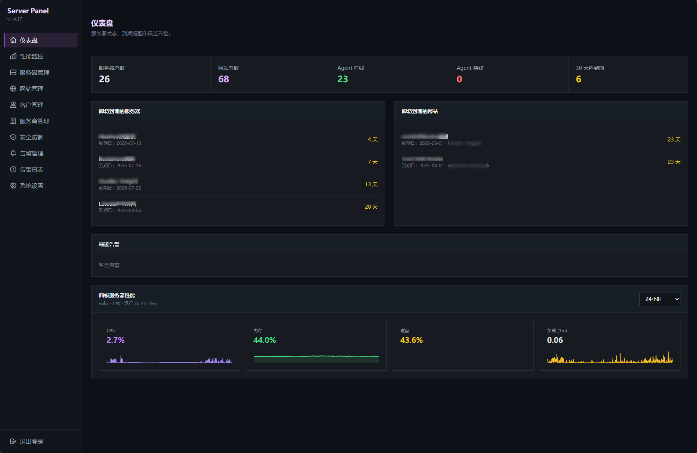
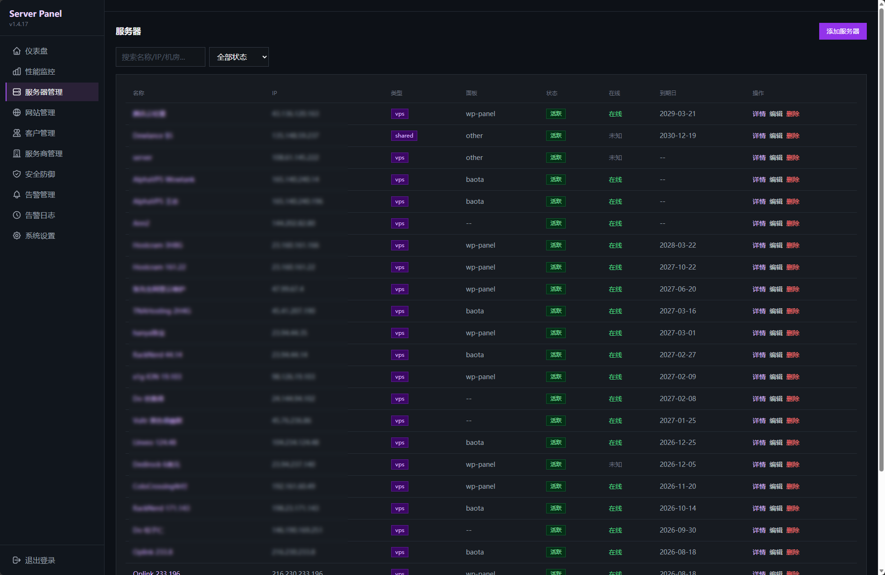
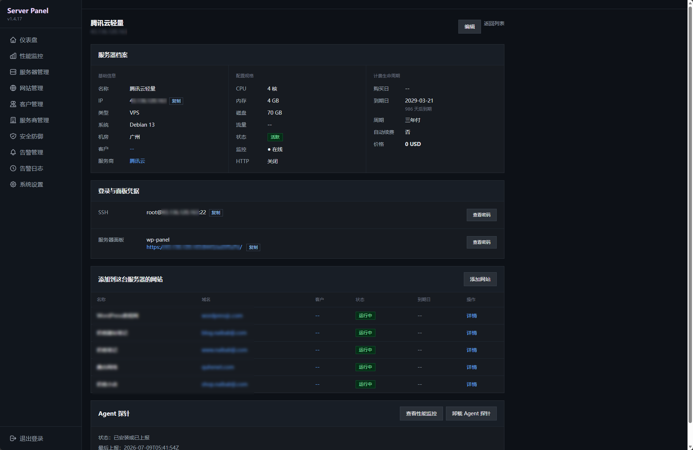
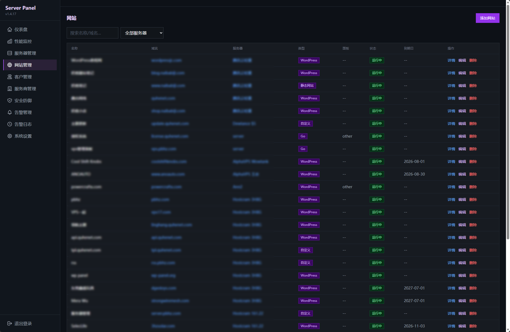
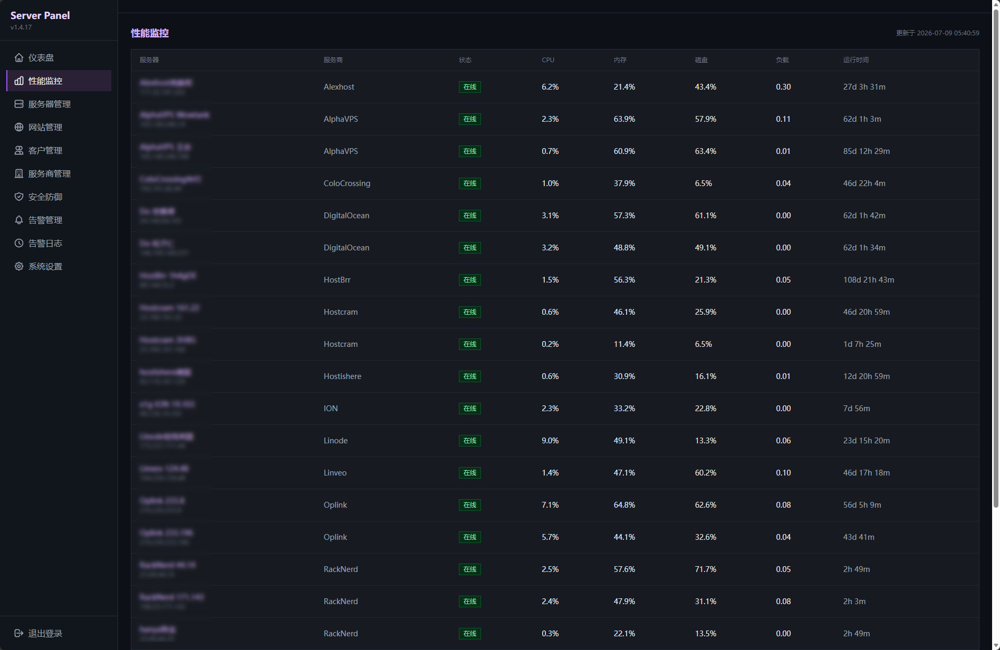
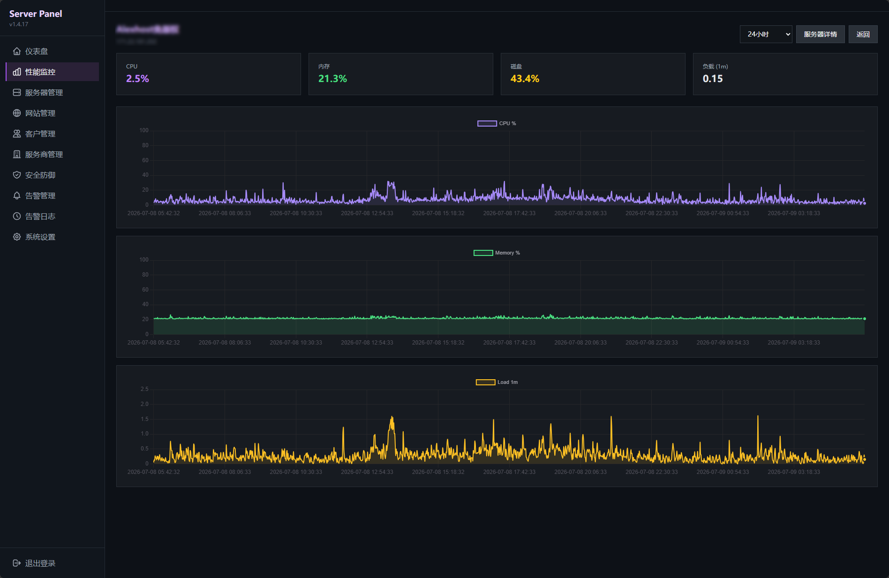
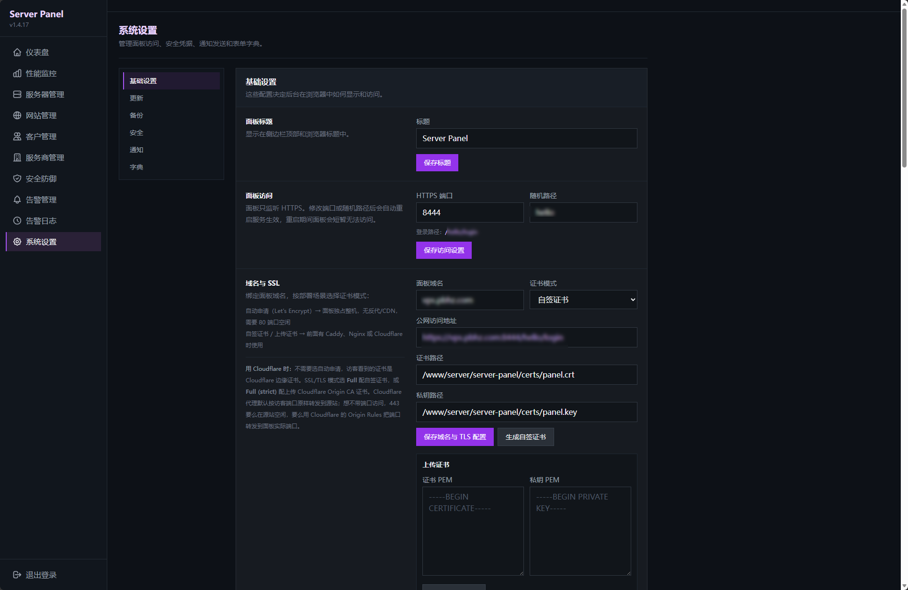

# Server Panel — Self-Hosted VPS Asset Management & Server Monitoring

> 🌐 **中文文档：**[阅读完整简体中文说明 →](README.md)

**English documentation**

[](LICENSE)
[](go.mod)
[](#requirements)

Server Panel is a security-focused, lightweight, open-source server management panel for independent developers, website owners, hosting operators, and small infrastructure teams. It brings **VPS and dedicated-server assets, websites, customers, providers, renewals, Agent-based performance monitoring, alerts, backups, and everyday file operations** into one private dashboard.

Built with Go and SQLite, Server Panel deploys as a single binary and includes a bilingual Chinese/English UI, built-in HTTPS, layered login protection, and encrypted credential storage. It is a practical self-hosted choice for anyone looking for a VPS management panel, server asset inventory, website expiry reminder, or lightweight Linux server monitoring dashboard without sending credentials and customer data to a third-party SaaS.

> Debian 13 is the primary development and test platform. Other Debian/Ubuntu systems using systemd may work, but are not guaranteed to be fully compatible.

## Highlights

- **Centralized asset inventory:** manage servers, websites, customers, and providers, including ownership, location, pricing, currency, purchase dates, and expiry dates.
- **Agent-based monitoring:** collect CPU, memory, disk, network, load, uptime, and heartbeat data with fleet and per-server history views.
- **Availability and renewal tracking:** HTTP probes, Agent offline detection, server reachability checks, server/website expiry reminders, and recurring renewal-date advancement.
- **Flexible alerts:** rules for CPU, memory, disk, offline servers, failed HTTP probes, and expiring assets, with SMTP email notifications.
- **Encrypted secrets:** protect SSH passwords, control-panel passwords, website credentials, private provider notes, and Agent keys.
- **Files and local storage:** upload, download, copy, move, rename, compress, and extract inside restricted roots; inspect, mount, unmount, or initialize local data disks.
- **Backup and restore:** create manual or scheduled backups containing both SQLite data and the encryption key, with retention, optional email delivery, and upload restore.
- **Safe maintenance:** signed panel updates with health checks and rollback, automatic update policies, and Debian/Ubuntu package update support.
- **Bilingual interface:** switch between Simplified Chinese and English from the login page or dashboard.

## Quick Install

Run as `root` on a Debian/Ubuntu server using systemd:

```bash
curl -fsSL https://raw.githubusercontent.com/naibabiji/server-panel/master/install.sh | bash
```

The installer downloads the latest `amd64` or `arm64` release and creates a self-signed TLS certificate, randomized URL path, panel account, BasicAuth credentials, and systemd service.

Open the generated URL after installation:

```text
https://your-server:8444/<random-path>/login
```

Credentials are printed in the installation log. The installer opens the HTTPS port when UFW or firewalld is already active. If your provider uses a cloud firewall or security group, allow the matching TCP port there as well (default: `8444`).

## Screenshots

<table>
  <tr>
    <td width="50%" align="center"><a href="screenshots/dashboard.png"></a><br><sub>Assets, Agents, expirations, and alerts</sub></td>
    <td width="50%" align="center"><a href="screenshots/servers.png"></a><br><sub>Server asset inventory</sub></td>
  </tr>
  <tr>
    <td width="50%" align="center"><a href="screenshots/servers-2.png"></a><br><sub>Configuration, renewals, Agent, and credentials</sub></td>
    <td width="50%" align="center"><a href="screenshots/websites.png"></a><br><sub>Websites, domains, and expiry tracking</sub></td>
  </tr>
  <tr>
    <td width="50%" align="center"><a href="screenshots/monitor.png"></a><br><sub>Fleet monitoring overview</sub></td>
    <td width="50%" align="center"><a href="screenshots/monitor-2.png"></a><br><sub>CPU, memory, disk, network, and load history</sub></td>
  </tr>
  <tr>
    <td width="50%" align="center"><a href="screenshots/settings.png"></a><br><sub>Access, security, backup, notification, and update settings</sub></td>
    <td width="50%"></td>
  </tr>
</table>

## Features in Detail

### Servers, Websites, Customers, and Providers

- Track VPS instances, dedicated servers, shared hosting, and other server assets.
- Store IP address, operating system, CPU, memory, disk, bandwidth, location, SSH/control-panel details, dates, renewal cycle, price, and status.
- Link servers to customers and providers, and websites to servers and customers; detail pages expose related records.
- Search, filter, and paginate records. Operating-system and website-type dictionaries are configurable.
- Enable HTTP probing, automatic renewal-date advancement, and an independent Agent installation key per server.

### Monitoring and Alerts

- The Agent reports CPU, memory, disk, network, load, uptime, version, and heartbeat data.
- The fleet view groups servers by provider; individual server pages show historical charts.
- The panel also collects its own host metrics and deletes old history according to a configurable retention period.
- Alert rules cover Agent offline events, high CPU/memory/disk usage, failed HTTP probes, and server or website expiration.
- SMTP testing, email notifications, alert history, and resolution state are included.

### Files, Disks, and Operations

- The file manager is limited to the panel data directory, mounted storage, and restricted roots explicitly added by an administrator.
- Upload, download, create directories, rename, delete, copy, move, compress, and extract files, with important actions logged.
- Inspect disks and partitions; mount, unmount, check user permissions, format or initialize data disks, and maintain automatic mounts.
- Review panel operation logs and background task state from Settings.

> Formatting or initializing a disk erases target data. Verify the device path and keep an independent backup before using these operations.

### HTTPS, Updates, and Backups

- Use a self-signed certificate, upload your own certificate, or issue a Let's Encrypt certificate through ACME.
- Panel updates include download, signature/checksum verification, database and binary backup, replacement, restart, health check, and automatic rollback on failure.
- Schedule daily or weekly backups, configure retention, and optionally deliver backups over SMTP when they fit the configured size limit.
- Restore the database and encryption key from a local backup or an uploaded `.tar.gz` archive.

## Security Model

Server Panel may hold infrastructure access details and customer data, so it uses several layers of protection:

1. A randomized URL path reduces discovery by generic scanners.
2. Optional BasicAuth protects the entry point in addition to the independent panel login.
3. Failed entry/login attempts and malicious path scans trigger automatic bans. nftables integration, allowlisting, and manual unbanning are available.
4. Sensitive credentials are encrypted and require a separate view password even after panel login.
5. Five consecutive incorrect view-password attempts erase stored secrets, but do not delete servers, websites, customers, monitoring history, or expiry records.
6. Each Agent has an independent key. Regenerating its installation command invalidates the previous key, and the Agent only reports monitoring data.
7. Trusted reverse proxies and Cloudflare real-client IP handling are configurable; Cloudflare network ranges are refreshed periodically.

A usable disaster-recovery backup must contain both the database and the encryption key. Full backups generated from Settings include both.

> Self-hosting does not make a service automatically secure. Use strong passwords and HTTPS, and place the panel behind a cloud firewall, VPN, Tailscale, WireGuard, Cloudflare, or a trusted reverse proxy when appropriate.

## Installation and Maintenance

### Requirements

- Linux with systemd (Debian 13 is the primary target)
- `amd64` or `arm64`
- `root` privileges for installation
- Access to GitHub Releases; an optional temporary GitHub proxy can be supplied when generating an Agent installer

Running the installer over an existing installation preserves configuration, database, certificates, and credentials while replacing the binary. To regenerate configuration and login details:

```bash
curl -fsSL https://raw.githubusercontent.com/naibabiji/server-panel/master/install.sh | INSTALL_MODE=reinstall bash
```

For an offline installation, place `install.sh` and the matching release binary in the same directory, then run `bash install.sh`.

Common commands:

```bash
systemctl status server-panel
systemctl restart server-panel
journalctl -u server-panel -f
server-panel --reset-password
```

Restore a full backup from the command line:

```bash
systemctl stop server-panel
server-panel -config /www/server/server-panel/config.json -restore-backup=/path/to/server-panel-backup.<timestamp>.tar.gz
systemctl start server-panel
```

## Intended Use and Limitations

Server Panel fits individuals managing multiple VPS or dedicated servers, small teams tracking customer websites, providers, costs, and renewals, and developers who want to self-host their monitoring and operations records.

It is not a large multi-tenant cloud platform and does not provide complex RBAC, approval workflows, ticketing, or container orchestration. It is designed as a lightweight private panel for a single administrator or a small trusted team.

## Contributing

Issues and pull requests are welcome. When reporting a problem, include the operating system, Server Panel version, reproduction steps, and relevant logs. Remove passwords, keys, IP addresses, and customer data from anything posted publicly.

## License

Server Panel is open source under the [GNU General Public License v3.0](LICENSE).

<!--
Search topics: self-hosted server management panel, VPS management panel, Linux server monitoring,
server asset management, website expiry reminder, uptime monitoring, Go SQLite admin panel
-->
